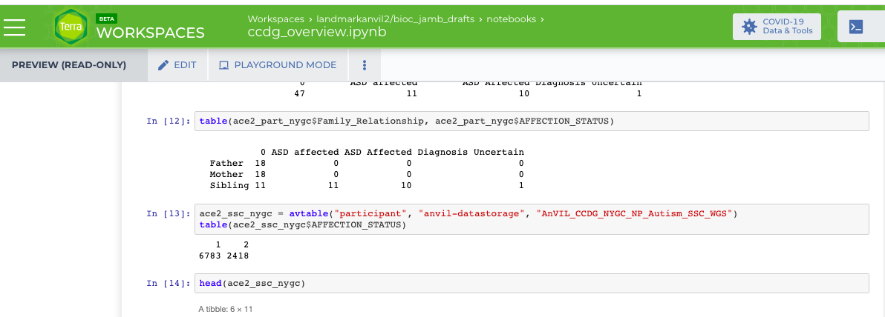

# _Bioconductor_ / _AnVIL_

## Project Activities

This site summarizes ongoing [_Bioconductor_][] development activities
related to [_AnVIL_][].

Learn more [about][] _Bioconductor_ and _AnVIL_.

## Project Activities Overview

- [Available Now](#now)
- [In Progress](#inprogress)
- [Future](#future)
- [Details](#details)

<a name="now"></a>
### Available Now

- Jupyter _R_ / _Bioconductor_ notebooks
  ([image][terra-jupyter-bioconductor:image],
  [github][terra-jupyter-bioconductor:github]). Use by choosing the
  'Bioconductor' Notebook Runtime.


- [AnVIL][anvil:bioconductor] _R_ package for user- and
  developer-oriented AnVIL-specific functionality. Install with:

  - `BiocManager::install("Bioconductor/AnVIL")` -- _Bioconductor_
    version 3.10 (_R_ 3.6.*) on the AnVIL.
  - `BiocManager::install("AnVIL")` -- _Bioconductor_
    version 3.11 (_R_ 4.0.0) or later.
    
- [AnVILBilling](https://github.com/bjstubbs/AnVILBilling) _R_ package for tracking and detailing billing and usage of the AnVIL and Terra resources

<a name="inprogress"></a>
### In Progress

- _RStudio_ _R_ / _Bioconductor_
  ([image][anvil-rstudio-bioconductor:image],
  [github][anvil-rstudio-bioconductor:github]). Use by selecting a
  'custom' Notebook Runtime and entering the container image
  `us.gcr.io/anvil-gcr-public/anvil-rstudio-bioconductor:0.0.5`. The image now has R-4.0.0 and the latest stable release Bioc 3.11.


- AnVIL / _Bioconductor_ oriented workshops
  - [BCC 2020][]. See R / Bioconductor in the Cloud description [here][]
  - [Bioc 2020][]. Tentative [workshop materials][]

- Continued development of [Training Materials][]

- User tool for instrumentation analysis. Cost estimation of RAM, disk, time,
  etc.

<a name="future"></a>
### Future

- _Kubernetes_ support for _Bioconductor_ in AnVIL

<a name="details"></a>
## Project Activities --  Detailed

This section provides a more detailed description of projects.

- [Containers](#containers)
- [User and Developer Tools](#tools)
- [Metadata access and overview](#metad)

<a name="containers"></a>
### Containers

The latest terra-jupyter-bioconductor docker containers are available
at [AnVIL][] and on the Google Container Registry ([gcr][]). These
containers have the Bioconductor release version 3.10, and R version
3.6 as jupyter notebooks. They work like the [bioconductor_docker][]
images, with the capability to install 'all of' _Bioconductor_
packages along with a few pre-installed "core" set of packages. The 
terra-jupyter-bioconductor image inherits from the terra-jupyter-r 
image which has all the system dependencies installed. This image has 
been tested on Leonardo and installs all but a few packages in 
_Bioconductor_ release 3.10, which fail due to achived CRAN dependencies.

The images are based on _R_ version 3.6 and _Bioconductor_ version
3.10.

Jupyter notebooks

- [image][terra-jupyter-bioconductor:image],
  [github][terra-jupyter-bioconductor:github], _Bioconductor_
  [github][terra-jupyter-bioconductor:github] (use for
  _Bioconductor_-specific issues).

RStudio / _Bioconductor_

- [image][anvil-rstudio-bioconductor:image],
  [github][anvil-rstudio-bioconductor:github].

- The terra-rstudio-bioconductor docker container is currently
  available as a custom 'bring your own' image to terra while work on
  a fully integrated RStudio environment is being developed.

_Kubernetes_

- [Slides](https://docs.google.com/presentation/d/1Y7g_6X8I6DPaNK84EzWNo1wVpfAwdORGt6kcgcPYOV4/edit?usp=sharing)

- Illustration of working with R and Kubernetes : https://github.com/shwetagopaul92/hgvarByKub

- [k8sredis][] An alternative approach: k8s with redis work queue and
  BiocParallel functionality. Start a number of parallel jobs on k8s,
  then an interactive 'manager' (e.g., RStudio session; Jupyter
  notebook).  Once in R one can

    ```
    library(RedisParam)
    fun = function(i, ...) {
        Sys.sleep(1)
        system("hostname", intern=TRUE)
    }

    p <- RedisParam(
        workers = 5, jobname = "demo",
        is.worker = FALSE
    )
    res <- bplapply(1:13, fun, BPPARAM = p)

    table(unlist(res))
    ## five-worker-5ns79 five-worker-8gh5q
    ##                 2                 2
    ## five-worker-dvdtv five-worker-wt5jq
    ##                 3                 3
    ## five-worker-zwlpw
    ##                 3
    ```

<a name="tools"></a>
### User and Developer Tools

AnVIL package ([_Bioconductor_][anvil:bioconductor],
[github][anvil:github]).

- This _R_ package provides both developer-oriented and user-oriented
  AnVIL-specific functionality.
- `av*()` facilities for interacting with workspace data elements.
- `gsutil_*()` facilities for interacting with the Google cloud.
- Developer-oriented access to major AnVIL components (Terra,
  Leonardo, Dockstore, and Gen3) REST APIs. Bearer-token
  authentication requires gcloud sdk installation. Work on expanding
  and implemented additional REST APIs in on-going.

Binary package installation (under development)

- Because the software environment is fixed by the container, packages
  can be pre-built and rapidly installed simply by copying from an
  online repository. We are developing the tooling to support this
  repository (as folders in google buckets) and to facilitate easy
  installation (via the `AnVIL::install()` function).

<a name="metad"></a>
### Metadata access and overview

<!--
Email by Vince to Ingestion members -- Kristin Wuichet, Robert Carroll,
Garrett Rupp

Hi Kristin, Robert, Garrett --

After Brian O'Connor's talk on interoperability I raised a question related
to CCDG data content that we have been looking at in preparation for the
NHGRI AnVIL CCDG/CMG jamboree.  We wanted to see how easy it
is to survey participant phenotype data.
-->

AnVIL package tools can be used to discover incompatibilities
or ambiguities in study annotation.  BJ's class worked through
metadata survey exercises.  An example of incompatible/ambiguous
annotation is present in the Autism workspaces.



We are looking at two studies from NYGC referring to autism, one has substring
ACE2 and the other SSC.  What we see above is that AFFECTION_STATUS is coded 1/2 in the SSC study,
and more prosaically in the ACE2 study.  It may be that the
labels in ACE2 study are more problematic as the options seem to be "0", "ASD affected",
"ASD Affected", and "Diagnosis uncertain" -- or perhaps it is just a letter casing issue.

The ingestion group was notified and replied that "there is no process for the
AnVIL team to retrospectively address existing data".  Interest was expressed in
learning more about our metadata survey capabilities.

[_Bioconductor_]: https://bioconductor.org
[_AnVIL_]: https://anvilproject.org
[about]: about
[Training Materials]: training
[AnVIL]: https://anvil.terra.app
[AnVIL_package]: https://github.com/Bioconductor/AnVIL
[gcr]: https://console.cloud.google.com/gcr/images/broad-dsp-gcr-public/US/terra-jupyter-bioconductor
[bioconductor_docker]: https://github.com/Bioconductor/bioconductor_docker
[k8sredis]: https://github.com/Bioconductor/k8sredis
[BCC 2020]: https://bcc2020.github.io/
[here]: https://bcc2020.github.io/training/
[Bioc 2020]: http://bioc2020.bioconductor.org/
[workshop materials]: https://github.com/waldronlab/AnVILWorkshop

[anvil:bioconductor]: https://bioconductor.org/packages/AnVIL
[anvil:github]: https://github.com/Bioconductor/AnVIL

[terra-jupyter-bioconductor:image]: https://us.gcr.io/broad-dsp-gcr-public/terra-jupyter-bioconductor:0.0.14
[terra-jupyter-bioconductor:github]: https://github.com/DataBiosphere/terra-docker/tree/master/terra-jupyter-bioconductor
[terra-jupyter-bioconductor:bioconductor]: https://github.com/Bioconductor/terra-docker

[anvil-rstudio-bioconductor:image]: https://us.gcr.io/anvil-gcr-public/anvil-rstudio-bioconductor:0.0.5
[anvil-rstudio-bioconductor:github]: https://github.com/anvilproject/anvil-docker

[Google Container Registry]: https://cloud.google.com/container-registry/docs/pushing-and-pulling
